# <h1 align="center"> Docsify Setup Document <b> </b></h1> 

# **Table of content**

- [Overview](#overview)

- [Purpose](#purpose)

- [Steps](#steps)

- [Github](#github)

# **Overview**

>Docsify is a tool that helps you create really nice and easy-to-read documentation websites for your projects. It takes your plain text and makes it look great on the web, with features like smooth scrolling and search. It's a favorite among developers for making user-friendly documentation.

# **Purpose**
>Creating documentation in Markdown, using Docsify, and integrating it with GitHub makes it easy to explain your project, helps people understand and use it, lets you work together with others, and ensures that your information is organized, searchable, and up-to-date. It's like making a user-friendly guidebook for your project that everyone can access and contribute to.

# **Steps**
- Update your system.

- Docsify is built on top of Node.js, so you need to install it along with npm (Node Package Manager).

- Install Docsify 

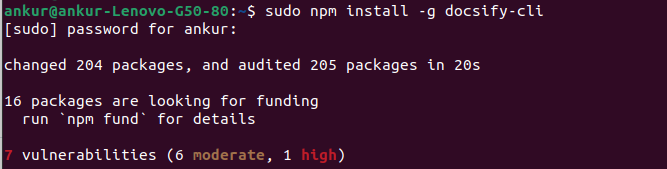

- Create a directory where you want to host your Docsify documentation. And then change your directory.

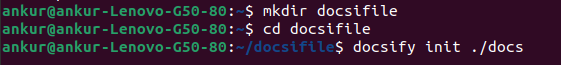

- Initialize Docsify in your documentation directory. This will create the necessary files and folder structure.

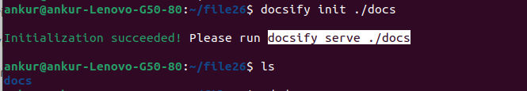

- Start the Docsify development server to preview your documentation. This will start a local server at http://localhost:3000, where you can see your Docsify documentation.

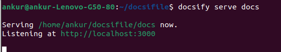

# **Github**

>Create a github  account and make a repository. To create a GitHub account Go to https://github.com/ Click on "Sign up" and follow the prompts to create your account then  Login github. 

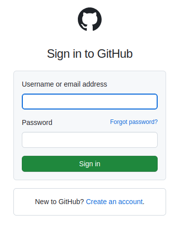

>Create GitHub Repository
- On GitHub, write the "Name your new repostory" then click on create a new repository button.

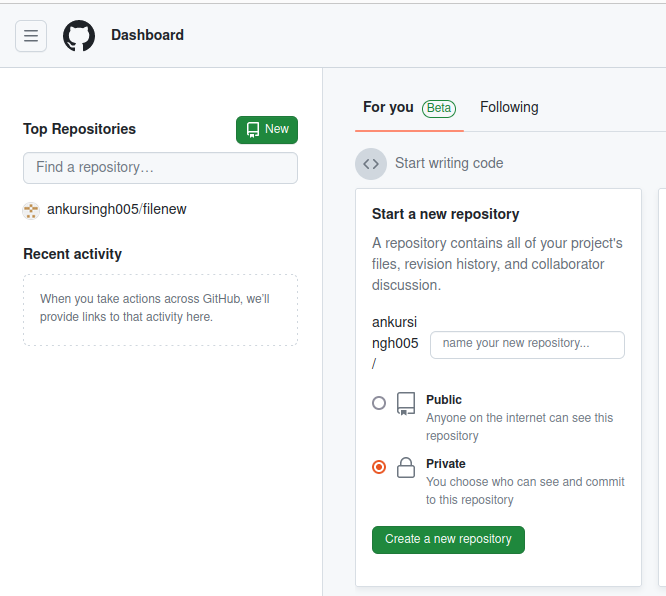

- Choose a name for your repository. Then Write a short description about your project or documentation. Choose whether the repository should be public or private. Then click create a repository. 

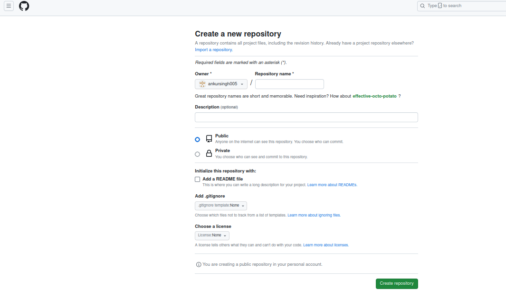

>create a new repository on the command line

- git init

- git add README.md

- git commit -m "first commit"

- git branch -M master

- git remote add origin https://github.com/ankursingh005/try.git

- git push -u origin master

>Generate a token to be used as a password when executing the git push -u origin master command.
- Open setting
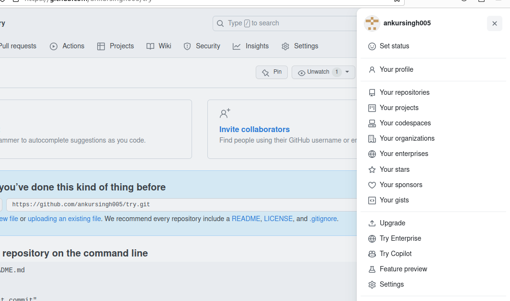
- Select Developer settings
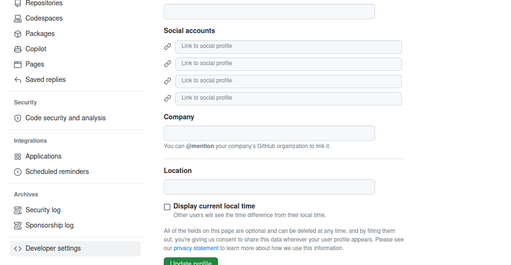
- Select Personal access token (Classic version)
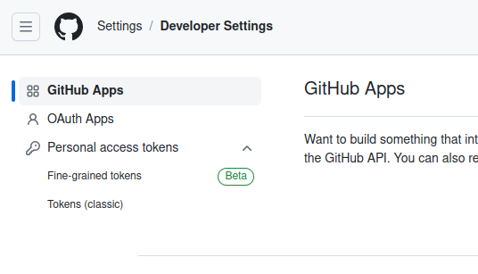
- Click generate new token
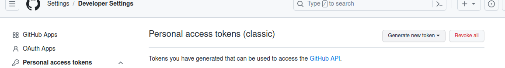

>Clone the Repository

